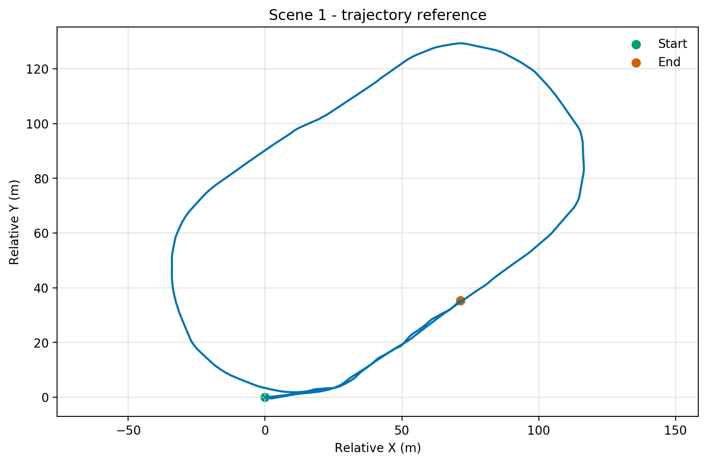
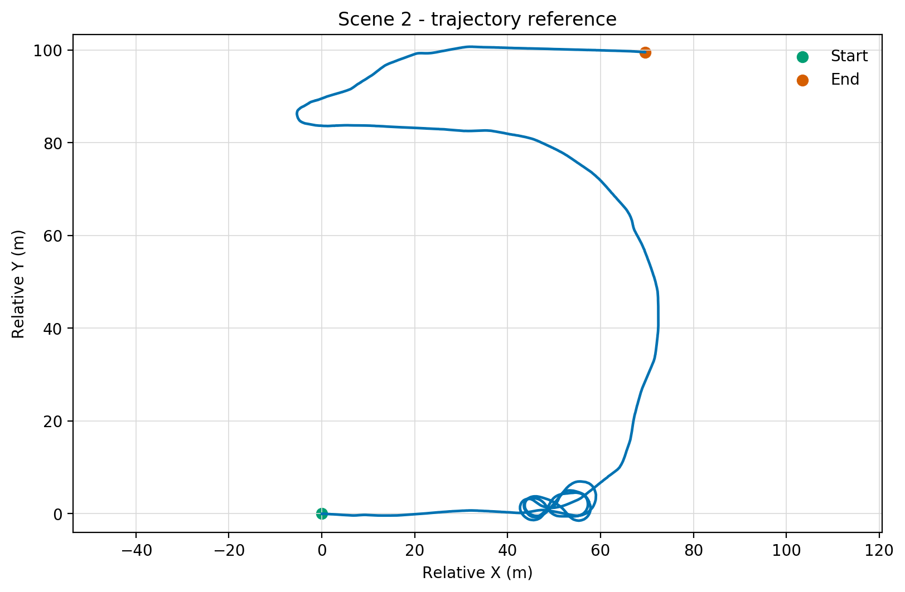

<div align="center">

<h1>第十届全国激光雷达大会</h1>
<h2>多传感器融合 SLAM 赛道</h2>
<p><strong>Multi-Sensor LiDAR SLAM Challenge 2026</strong></p>
<p>激光惯性 SLAM · 激光-图像-惯性 SLAM</p>

</div>

---

本仓库用于发布“多传感器融合 SLAM 赛道”的公开规则、数据获取说明、提交格式和赛道更新记录。赛道面向多传感器定位与建图任务，设置“激光惯性 SLAM”和“激光-图像-惯性 SLAM”两个子赛道。

> [!IMPORTANT]
> **当前状态：已正式发布。** 两个子赛道已在 Codabench 开放，比赛数据、标定、
> 提交格式和公开评价代码均已发布。如信息有调整，以大会官网、Codabench 和赛道
> 组织方最新通知为准。

## 📌 赛道概览

| 项目 | 信息 |
| --- | --- |
| 大赛官网 | [第十届全国激光雷达大会·数据处理大赛](https://www.lidar2026shenzhen.com/onepage.php?id=9) |
| 赛道状态 | 已正式发布 |
| 激光惯性 SLAM | [Codabench 比赛入口](https://www.codabench.org/competitions/17677/) |
| 激光-图像-惯性 SLAM | [Codabench 比赛入口](https://www.codabench.org/competitions/17678/) |
| 牵头单位 | 武汉大学测绘遥感信息工程全国重点实验室 |
| 赛道牵头人 | 陈驰，教授；研究方向包括智能无人系统感知、定位、导航与建图（SLAM）关键技术及装备研制等 |
| 赛道咨询 | 徐宇航 · [yuhangxu@whu.edu.cn](mailto:yuhangxu@whu.edu.cn)；闫涛 · [yantaoslam@qq.com](mailto:yantaoslam@qq.com) |
| 结果提交 | 通过对应子赛道的 Codabench 页面在线提交 |
| 大赛报名 | [lidar2026@126.com](mailto:lidar2026@126.com) |

## 🗓️ 重要日期

| 事项 | 时间 |
| --- | --- |
| 📨 参赛报名 | 通知发布后至 **2026-09-20 23:59**（北京时间） |
| 📦 结果提交截止 | **2026-09-20 23:59**（北京时间） |
| 🏆 结果公布 | **2026-09-23** |

> [!NOTE]
> 报名与结果提交的截止时间相同。请预留邮件确认、数据下载和结果打包时间。

## 🎯 任务说明

参赛者需要基于组织方提供的多传感器 ROS bag 数据，开发鲁棒、可复现的 SLAM 算法，估计传感器连续位姿轨迹，并按要求提交两个场景的轨迹结果。

| 子赛道 | 输入 | 输出 |
| --- | --- | --- |
| **激光惯性 SLAM** | Airy LiDAR 点云、内置 IMU | `scene_0001` 和 `scene_0002` 的 TUM 轨迹 |
| **激光-图像-惯性 SLAM** | Airy LiDAR 点云、内置 IMU、Seeker 前部左右鱼眼图像 | `scene_0001` 和 `scene_0002` 的 TUM 轨迹 |

赛道重点考察算法的**定位建图精度、鲁棒性和工程可复现性**。

## 🗂️ 数据集说明

数据集名称为 **Multi-Sensor LiDAR SLAM Challenge Dataset**，以两个实际场景的
ROS1 bag 发布，包含 Airy LiDAR 点云、LiDAR 内置 IMU 和 Seeker 前部左右鱼眼图像。

> [!WARNING]
> 🔒 赛道真值仅由组织方用于结果测评，**发布的数据集中不包含真值**。

### 数据发布计划

| 阶段 | 内容 | 状态 |
| --- | --- | --- |
| 赛道规则 | README、提交格式和更新记录 | 已发布 |
| 场景数据 | 两个场景的 ROS bag | 已发布 |
| 标定与数据说明 | 标定参数、topic 和时间说明 | 已发布 |
| 提交与测评说明 | Codabench 提交和正式评分规则 | 已发布 |

## 📥 数据获取

比赛数据通过百度网盘发布，标定和配套说明由本仓库公开维护。

| 资源 | 下载或说明 |
| --- | --- |
| 分享文件 | `2026-07-26-lidar-contest-data` |
| 百度网盘链接 | [下载比赛数据](https://pan.baidu.com/s/1c1jifyQrFvXWyAs64TCqRg) |
| 提取码 | `m2nt` |
| 数据与标定 | [数据与标定说明](docs/数据与标定说明.md) |
| 评价与提交 | [评价与提交说明](docs/评价与提交说明.md) |

> [!CAUTION]
> 数据仅限本次比赛和相关研究使用。未经组织方许可，不得二次分发、公开上传、商用或用于与本赛道无关的评测。论文、报告或开源项目中的引用应遵循后续发布的引用格式和授权条款。

## 🚀 参赛流程

1. **提交报名表**：在大赛官网下载报名表，填写后发送至 [lidar2026@126.com](mailto:lidar2026@126.com)。
2. **确认报名**：收到大赛组委会的确认通知后，即报名成功。
3. **开发与验证**：基于已发布的 ROS bag 包和相关文件完成算法开发、参数调试和本地验证。
4. **生成结果**：处理组织方指定的测评数据，生成各场景对应的轨迹文件。
5. **本地校验**：使用本仓库公开校验器检查目录结构和 TUM 格式。
6. **在线提交**：将结果 ZIP 上传到对应子赛道的 Codabench 页面。
7. **查看结果**：在 `My Submissions` 查看详细评分，在 `Results` 查看排行榜。

| 子赛道 | 提交入口 |
| --- | --- |
| 激光惯性 SLAM | [Codabench 17677](https://www.codabench.org/competitions/17677/) |
| 激光-图像-惯性 SLAM | [Codabench 17678](https://www.codabench.org/competitions/17678/) |

> 本赛道采用离线数据处理、Codabench 在线评分的方式。

## 📤 提交内容

每个子赛道分别提交一个 `zip` 文件。压缩包中必须包含队伍说明文件和两个场景的
轨迹文件。参加两个子赛道时，应分别上传到两个 Codabench 比赛，不得合并为一个包。

**压缩包命名：** `team_name_submission.zip`

### 目录结构

```text
submission.zip
├── README.md
└── trajectories/
    ├── scene_0001.txt
    └── scene_0002.txt
```

| 路径 | 要求 |
| --- | --- |
| `README.md` | **必填**。包含队伍名称、成员、联系方式、参加子赛道、方法简述、运行环境和外部资源使用说明 |
| `trajectories/scene_0001.txt` | **必填**。场景 1 的 TUM 轨迹 |
| `trajectories/scene_0002.txt` | **必填**。场景 2 的 TUM 轨迹 |

ZIP 根目录不得额外嵌套队伍名或 `submission/` 目录。完整格式见
[评价与提交说明](docs/评价与提交说明.md)。

## 📍 轨迹文件格式

轨迹文件必须采用 **TUM trajectory** 格式。每个待测场景对应一个 `.txt` 文件，文件名必须与组织方发布的场景编号一致，例如 `scene_0001.txt`。

**每行 8 列：**

```text
timestamp tx ty tz qx qy qz qw
```

| 字段 | 类型 | 说明 |
| --- | --- | --- |
| `timestamp` | `float64` 或 `float32` | 时间戳，单位为秒，应与对应 bag 包时间戳一致 |
| `tx ty tz` | `float64` 或 `float32` | 平移，单位为米 |
| `qx qy qz qw` | `float64` 或 `float32` | 归一化四元数，顺序为 `[x, y, z, w]` |

### 文件要求

- 不得包含 `NaN`、`Inf` 或非数值字段。
- 轨迹行应按时间戳升序排列。
- 不得修改待测数据的原始时间戳。
- 不允许重复时间戳或零四元数。
- 两个场景文件缺一不可；完成度不设硬性门槛，缺失轨迹会降低 AUC。
- 轨迹表示 Airy LiDAR 内置 IMU 原点的位姿。

## 📊 评估指标

平台在每个场景内对全部有效匹配位姿执行一次无尺度 SE(3) EVO 对齐，再计算 AUC、
ATE 和 RTE。最终排名按总分从高到低排列。

两个场景不会分别计算总分后再取平均。评分器先让两个场景各自完成时间关联和一次
SE(3) 对齐，再合并两场景的原始 APE、相邻帧 RPE 和距离 RPE 误差：ATE/RTE 对
合并后的误差计算 RMSE，AUC 对合并后的相邻帧误差和两场景理论配对总数重新积分。
由此得到一组总体 AUC、ATE、RTE，最后只代入一次总分公式。

| 指标 | 说明 |
| --- | --- |
| **AUC** | 连续一帧平移 RPE 的 F1-AUC，范围 `[0,1]`，越高越好 |
| **ATE** | EVO 平移绝对轨迹误差 RMSE，单位为米，越低越好 |
| **RTE** | 参考轨迹 1 m、5 m、10 m 距离尺度上的相对平移误差，越低越好 |

### 总分

```text
Total Score = 100 * (
    0.40 * AUC
  + 0.40 * exp(-ATE / tau_ate_m)
  + 0.20 * exp(-RTE / tau_rte_pct)
)
```

正式参数为：

```text
tau_ate_m   = 1.1542008644767718
tau_rte_pct = 33.05656442344478
```

平台公开总分、总体及逐场景 AUC/ATE/RTE、RTE@1m/5m/10m、完成度和匹配数量。
公开参考结果总分为 `61.370935022338`，仅用于比较，不是及格线。计算细节见
[评价与提交说明](docs/评价与提交说明.md)。

> **提交次数限制：** 每个子赛道每日最多 5 次提交，排行榜采用参赛者最后一次有效提交。

## 🧰 公开资料与代码

```text
LiDAR-SLAM-Challenge-2026/
├── README.md
├── docs/                 # 数据标定和评价说明
├── calibration/          # LiDAR-IMU 与双鱼眼相机标定
├── config/               # 两个赛道配置和公开参考指标
├── scoring/              # 公开评分与格式校验代码
├── assets/               # 场景轨迹参考图
└── requirements.txt
```

安装依赖并检查解压后的提交：

```bash
python3 -m pip install -r requirements.txt

PYTHONPATH=. python3 -m scoring.validator \
  --submission /path/to/unzipped_submission \
  --config config/lidar_inertial.json
```

视觉赛道将配置替换为 `config/lidar_visual_inertial.json`。公开校验器只检查目录和
TUM 格式，不读取真值，也不在本地计算比赛精度。

## ⚖️ 资源与行为规范

### ✅ 允许使用

- 组织方公开发布的场景数据和相关文件。
- 公开论文、公开代码、公开预训练模型和公开可获取的数据集。
- 外部资源必须在提交包 README 中明确说明来源、版本、用途、授权情况和下载地址；无法公开核验来源或授权状态的外部数据默认不得使用。

### ⛔ 禁止行为

- 使用未公开的赛道真值、内部文件或组织方未授权材料。
- 未经许可二次分发、镜像或公开上传组织方提供的数据文件。
- 修改待测数据原始内容、时间戳或场景编号后再生成结果。
- 通过人工标注、人工对齐或其他方式针对测评真值进行结果修正。
- 多账号、多队伍重复提交以规避提交次数限制。
- 将本赛道数据用于未经许可的商业用途或与比赛无关的公开评测。

## 🧪 复现性要求

提交包中的 `README.md` 至少应包含：

- 队伍名称、成员、单位和联系人邮箱。
- 参加的子赛道。
- 方法名称和核心思路。
- 运行环境，包括操作系统、CPU/GPU 和主要依赖库版本。
- 是否使用外部数据、公开预训练模型或开源代码。
- 生成提交结果的主要命令或流程说明。

组织方可在获奖候选队伍复核阶段要求参赛队补充代码、Docker 镜像、环境配置或可执行程序，以确认结果可复现。无法完成必要复核的提交可能被取消获奖资格。

## 🗺️ 场景轨迹参考

以下图片用于展示两个场景的路线形状。

### Scene 1



### Scene 2



## 🛠️ 仓库维护

- 赛道规则、场景数据、标定、评价代码与配套说明已经发布，后续修订将记录在本仓库。
- 下载链接、文件状态和规则变更将优先通过 [Releases](https://github.com/DCSI2022/LiDAR-SLAM-Challenge-2026/releases)、[Issues](https://github.com/DCSI2022/LiDAR-SLAM-Challenge-2026/issues) 或 README 更新记录发布。
- 参赛队如发现文档歧义、数据损坏、链接失效或格式问题，可通过赛道咨询邮箱反馈。

## 📝 更新记录

| 日期 | 版本 | 更新内容 |
| --- | --- | --- |
| 2026-07-26 | v1.0 | 正式发布两个 Codabench 子赛道、比赛数据、标定、评分规则和公开格式校验代码 |
| 2026-07-16 | v0.1 | 创建赛道公开仓库 README，明确预发布状态、数据发布计划、提交格式和评测规则 |

---

<div align="center">

<strong>第十届全国激光雷达大会 · 多传感器融合 SLAM 赛道</strong>

</div>
